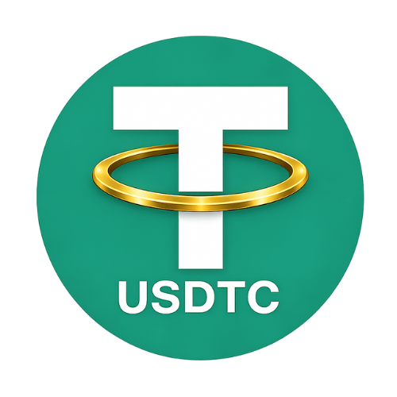

# USDTC – Community Token
USDTC is a BEP20 token on BNB Smart Chain designed for ecosystem participation, community engagement, and decentralized market experimentation.
USDTC is a Virtual Digital Asset (VDA) and not a stablecoin.

## 🔗 Official Links

Website: https://usdtc-community.co.in/
BscScan: https://bscscan.com/token/0x9bd1A819e773A5A7d0DdE4799056D55858Ace0Be  
PancakeSwap: https://pancakeswap.finance/swap?outputCurrency=0x9bd1A819e773A5A7d0DdE4799056D55858Ace0Be  
Telegram: https://t.me/usdtctoken  
Twitter: https://x.com/UsdtcCommunity  

## 🧾 Token Details

- Name: USDTC  
- Symbol: USDTC  
- Network: BNB Smart Chain  
- Standard: BEP20  
- Contract: 0x9bd1A819e773A5A7d0DdE4799056D55858Ace0Be  

## ⚙️ Supply Model

USDTC follows an elastic supply model.

- Rebase Rate: ~0.08% per cycle  
- Frequency: Once every 24 hours  
- Public rebase function  

## ⚠️ Important Notice

- USDTC is NOT a stablecoin  
- No price peg is maintained  
- No guaranteed returns  

## 🔐 Transparency

All transactions and supply changes are publicly verifiable on-chain via BscScan.

## 📄 Whitepaper

Refer to the official whitepaper for detailed protocol design and tokenomics.

---

USDTC is an independent project and is not affiliated with USDT or any stablecoin issuer.
